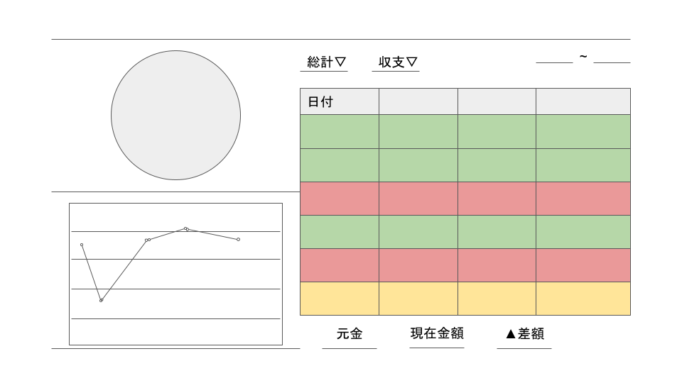

# 家計簿Webアプリ
家計簿をスプシで管理するようにしたが、微妙にレスポンスが遅いので勉強もかねてWebアプリを作る事にした。
今後React案件が回ってきそうな感じがあるので、久しぶりにReactのSPAを作ってみる。
SPAなのでとりあえずはcreate-react-appで作る
[Tutorialページを参照](https://ja.reactjs.org/docs/create-a-new-react-app.html#nextjs)
> Next.jsに以降するかも
できればVue.js+Nuxt.js版も作って教材みたいな感じにできたらいいなあ

# 設計
外観はこんな感じ

## ポイント
- 左側がグラフ、右側が表の2カラムレイアウト
- 円グラフは収支の種類を表し、チャートは貯金額の遷移を表す
  - 円グラフは収支/収入で選択する
- 表の表示は
  - 総計/銀行/手元を選べる
  - 収支/収入が選べる
  - 期間を選べる
- 表の各列の列名をクリックするとその順でソートできる
- +ボタンでモーダルを表示して表にデータを挿入
- -ボタンで削除
- ダウンロードボタンで表示されている表をCSVでダウンロード